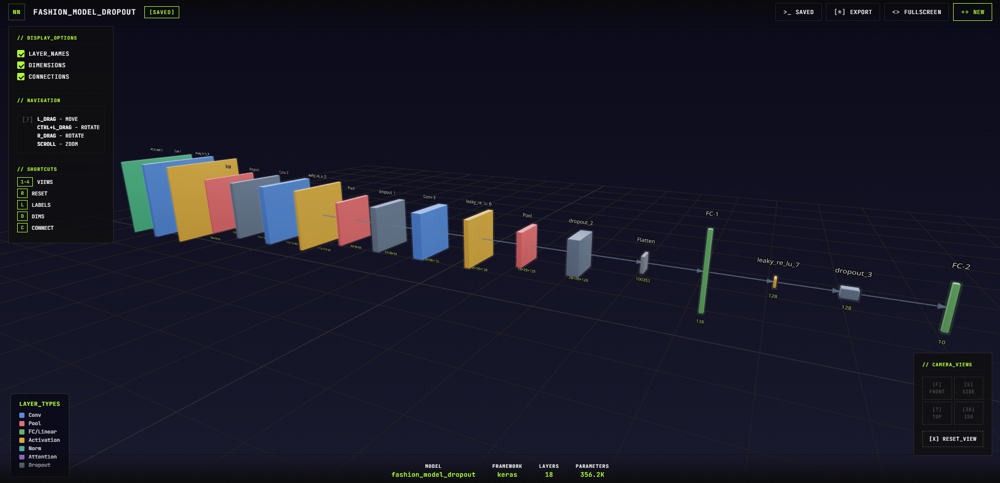

<div align="center">

```
╔═══════════════════════════════════════════════════════════════╗
║                                                               ║
║        3D NEURAL NETWORK VISUALIZER                          ║
║        Visualize, Understand, and Explore Deep Learning       ║
║        Architectures in Stunning 3D                          ║
║                                                               ║
╚═══════════════════════════════════════════════════════════════╝
```

[](https://threednn-visualiser.onrender.com/)
[](https://github.com/VishalPainjane/3dNN_Visualiser/stargazers)
[](./LICENSE)
[](https://github.com/VishalPainjane/3dNN_Visualiser/pulls)



*Transform complex neural networks into interactive 3D visualizations*

[**Explore Demo**](https://threednn-visualiser.onrender.com/) • [**Documentation**](./docs) • [**Report Bug**](https://github.com/VishalPainjane/3dNN_Visualiser/issues) • [**Request Feature**](https://github.com/VishalPainjane/3dNN_Visualiser/issues)

</div>

---

## > Why 3D Neural Network Visualizer?

Understanding neural network architectures shouldn't require hours of staring at text files or static diagrams. **3D Neural Network Visualizer** brings your models to life with:

- **Beautiful 3D Rendering** → See every layer, connection, and parameter in stunning detail
- **Real-Time Interaction** → Rotate, zoom, and explore your networks like never before
- **Deep Insights** → Click on layers to see detailed parameter information
- **Multiple Formats** → Support for PyTorch, ONNX, Keras, and custom `.nn3d` format
- **Zero Setup** → Drag and drop your model files and start visualizing instantly
- **Smart Layouts** → Choose from layered, circular, hierarchical, or force-directed layouts

> [!TIP]
> Try the live demo at [threednn-visualiser.onrender.com](https://threednn-visualiser.onrender.com/) to see it in action without any installation!

---

## < Features />

### Visualization Capabilities
- **3D Layer Geometry** → Each layer type renders as a distinct 3D shape (boxes, spheres, custom geometries)
- **Connection Styles** → Multiple edge rendering options (lines, bezier curves, 3D tubes, arrows)
- **Color Coding** → Automatic color assignment based on layer categories
- **Level of Detail** → Optimized rendering for networks with thousands of layers

### Interactive Controls
- **Orbit Navigation** → Intuitive mouse controls for rotation and panning
- **Layer Selection** → Click any layer to view detailed information
- **Hover Tooltips** → Quick parameter preview on mouse hover
- **Keyboard Shortcuts** → Fast access to common operations

### Layout Algorithms
- **Layered** → Traditional left-to-right topological layout
- **Force-Directed** → Physics-based spring simulation
- **Circular** → Nodes arranged in circular patterns
- **Hierarchical** → Tree-like arrangement based on network depth

### Developer Tools
- **Python Exporters** → Convert PyTorch, ONNX, and Keras models to `.nn3d` format
- **REST API** → Backend service for model parsing and analysis
- **Extensible Architecture** → Easy to add new layer types and visualizations

---

## Quick Start

### ./ Use Online (No Installation Required)

Visit the live demo: **[https://threednn-visualiser.onrender.com/](https://threednn-visualiser.onrender.com/)**

Simply drag and drop your model files to start visualizing!

> [!NOTE]
> The online demo supports all major model formats including ONNX, PyTorch, Keras, and the native `.nn3d` format.

### ./ Docker Deployment (Recommended)

```bash
# Clone the repository
git clone https://github.com/VishalPainjane/3dNN_Visualiser.git
cd 3dNN_Visualiser

# Start with Docker Compose
docker-compose up --build

# Access the application
# Frontend: http://localhost:3000
# Backend API: http://localhost:8000
# API Docs: http://localhost:8000/docs
```

> [!IMPORTANT]
> Ensure Docker and Docker Compose are installed on your system before running these commands.

### ./ Local Development

**Prerequisites:**
- Node.js 18+ 
- Python 3.11+
- npm or yarn

**Frontend Setup:**
```bash
# Navigate to frontend directory
cd frontend

# Install dependencies
npm install

# Start development server
npm run dev

# Open http://localhost:5173
```

**Backend Setup:**
```bash
# Navigate to backend directory
cd backend

# Install Python dependencies
pip install -r requirements.txt

# Start FastAPI server
uvicorn app.main:app --reload --port 8000

# API available at http://localhost:8000
```

---

## Supported Model Formats

| Format | Extension | Support Level | Notes |
|--------|-----------|---------------|-------|
| **ONNX** | `.onnx` | Full | Parsed directly in browser |
| **PyTorch** | `.pt`, `.pth`, `.ckpt` | Full | Via Python backend/exporter |
| **Keras/TF** | `.h5`, `.hdf5` | Full | Via Python backend/exporter |
| **TensorFlow SavedModel** | `.pb` | Full | Via Python backend |
| **Native** | `.nn3d`, `.json` | Full | Native format with full features |
| **SafeTensors** | `.safetensors` | Partial | Structure inferred from weights |

> [!WARNING]
> Models without explicit graph structure (e.g., PyTorch state_dicts) will be visualized as 3D weight matrices rather than architectural graphs.

---

## Usage Guide

### Loading Models

1. **Drag & Drop** → Drag any supported model file onto the drop zone
2. **Click to Upload** → Click the drop zone and browse for files
3. **Try Samples** → Use the included examples in `samples/` directory

### Navigation Controls

| Action | Control |
|--------|---------|
| **Rotate View** | Left Mouse + Drag |
| **Pan View** | Right Mouse + Drag |
| **Zoom** | Mouse Wheel |
| **Select Layer** | Left Click on Layer |
| **Quick Info** | Hover over Layer |

### Keyboard Shortcuts

| Key | Action |
|-----|--------|
| `1-4` | Switch layout (1=Layered, 2=Force, 3=Circular, 4=Hierarchical) |
| `L` | Toggle layer labels |
| `E` | Toggle edge visibility |
| `R` | Reset camera to default view |
| `Esc` | Deselect current layer |
| `Space` | Toggle auto-rotation |

> [!TIP]
> Press `?` or `H` at any time to view the full list of keyboard shortcuts in the application.

---

## Python Exporter

Convert your PyTorch, ONNX, or Keras models to the `.nn3d` format:

### Installation

```bash
cd exporters/python
pip install -e .
```

### PyTorch Example

```python
from nn3d_exporter import PyTorchExporter
import torch
import torch.nn as nn

# Define your model
model = nn.Sequential(
    nn.Conv2d(3, 64, kernel_size=3),
    nn.ReLU(),
    nn.MaxPool2d(2),
    nn.Flatten(),
    nn.Linear(64 * 31 * 31, 10)
)

# Create exporter
exporter = PyTorchExporter(model, "My CNN Model")

# Trace with example input
exporter.trace(torch.randn(1, 3, 64, 64))

# Save to .nn3d format
exporter.save("my_model.nn3d")
```

### ONNX Example

```python
from nn3d_exporter import ONNXExporter

# Export from ONNX file
exporter = ONNXExporter.from_file("model.onnx", "My Model")
exporter.save("model.nn3d")
```

> [!NOTE]
> The Python exporter automatically traces the computational graph and extracts layer parameters. For dynamic models, ensure you provide representative input tensors.

---

## .nn3d File Format

The `.nn3d` format is a JSON-based schema designed for neural network visualization:

```json
{
  "version": "1.0.0",
  "metadata": {
    "name": "ResNet-50",
    "framework": "pytorch",
    "totalParams": 25557032,
    "created": "2025-01-15T10:30:00Z"
  },
  "graph": {
    "nodes": [
      {
        "id": "conv1",
        "type": "conv2d",
        "name": "Input Convolution",
        "params": {
          "inChannels": 3,
          "outChannels": 64,
          "kernelSize": [7, 7],
          "stride": [2, 2]
        },
        "outputShape": [1, 64, 112, 112]
      }
    ],
    "edges": [
      {"source": "input", "target": "conv1"}
    ]
  },
  "visualization": {
    "layout": "layered",
    "theme": "dark"
  }
}
```

**[View Full Schema Documentation →](./docs/schema.md)**

---

## Tech Stack

<div align="center">

```
┌─────────────┬─────────────┬──────────────┬──────────┐
│  Frontend   │   Backend   │ Visualization│  Tools   │
├─────────────┼─────────────┼──────────────┼──────────┤
│  React 18   │   FastAPI   │   Three.js   │  Docker  │
│ TypeScript  │ Python 3.11 │  @r3f/fiber  │   Git    │
│    Vite     │   Uvicorn   │  @r3f/drei   │  GitHub  │
│  Zustand    │  Pydantic   │    WebGL     │  Render  │
└─────────────┴─────────────┴──────────────┴──────────┘
```

</div>

---

## Project Structure

```
3dNN_Visualiser/
├── backend/                 # Python FastAPI backend
│   ├── app/
│   │   ├── main.py         # API entry point
│   │   ├── models/         # Pydantic models
│   │   └── parsers/        # Model format parsers
│   └── requirements.txt
├── frontend/                # React frontend
│   ├── src/
│   │   ├── components/     # React components
│   │   │   ├── layers/    # 3D layer geometries
│   │   │   ├── edges/     # Connection rendering
│   │   │   └── ui/        # UI overlays
│   │   ├── core/          # State management
│   │   ├── schema/        # .nn3d types
│   │   └── App.tsx
│   └── package.json
├── exporters/
│   └── python/            # Python export package
│       ├── nn3d_exporter/
│       └── setup.py
├── samples/               # Example .nn3d files
├── docs/                  # Documentation
├── docker-compose.yml
├── README.md
└── LICENSE
```

---

## Supported Architectures

<details>
<summary><b>Computer Vision</b></summary>

- **CNNs** → ResNet, VGG, Inception, DenseNet, EfficientNet, MobileNet
- **Object Detection** → YOLO, R-CNN, Faster R-CNN, SSD, RetinaNet
- **Segmentation** → U-Net, Mask R-CNN, DeepLab, SegNet
- **GANs** → StyleGAN, CycleGAN, Pix2Pix
</details>

<details>
<summary><b>Natural Language Processing</b></summary>

- **Transformers** → BERT, GPT, T5, BART, RoBERTa
- **LLMs** → GPT-3/4, LLaMA, Claude, Mistral
- **Seq2Seq** → LSTM, GRU, Attention models
- **Embeddings** → Word2Vec, GloVe, FastText
</details>

<details>
<summary><b>Audio & Speech</b></summary>

- **ASR** → Wav2Vec, Whisper, DeepSpeech
- **TTS** → Tacotron, WaveNet, FastSpeech
</details>

<details>
<summary><b>Multimodal</b></summary>

- **Vision-Language** → CLIP, DALL-E, Flamingo, BLIP
- **Video** → TimeSformer, VideoMAE
</details>

---

## Contributing

We love contributions! Whether it's bug fixes, new features, or documentation improvements - all contributions are welcome.

### How to Contribute

```
1. Fork the repository
        ↓
2. Create your feature branch
   git checkout -b feature/AmazingFeature
        ↓
3. Commit your changes
   git commit -m 'Add some AmazingFeature'
        ↓
4. Push to the branch
   git push origin feature/AmazingFeature
        ↓
5. Open a Pull Request
```

### Development Guidelines

- Follow the existing code style
- Write clear commit messages
- Add tests for new features
- Update documentation as needed
- Ensure all tests pass before submitting PR

> [!IMPORTANT]
> Please read our [Contributing Guide](./CONTRIBUTING.md) before submitting pull requests. All contributions must follow our code of conduct.

---

## Roadmap

```
[x] Core 3D visualization engine
[x] Support for major deep learning frameworks
[x] Interactive layer exploration
[x] Python exporters for PyTorch/ONNX/Keras
[ ] Model comparison mode (side-by-side)
[ ] Animation of forward/backward passes
[ ] Performance profiling visualization
[ ] Collaborative sharing features
[ ] Mobile app (iOS/Android)
[ ] VSCode extension
[ ] Training metrics overlay
[ ] Export to Unity/Unreal Engine
```

**[View Full Roadmap →](https://github.com/VishalPainjane/3dNN_Visualiser/projects)**

---

## Performance

| Network Size | Layers | Parameters | Load Time | FPS |
|-------------|--------|------------|-----------|-----|
| Small (MLP) | 10-50 | <1M | <1s | 60 |
| Medium (ResNet) | 50-200 | 1M-50M | 1-3s | 60 |
| Large (BERT) | 200-500 | 50M-200M | 3-8s | 45-60 |
| XL (GPT-3) | 500+ | 200M+ | 10-20s | 30-45 |

> [!NOTE]
> Performance metrics tested on Chrome 120, MacBook Pro M1, 16GB RAM. Your results may vary based on hardware and browser.

---

## Troubleshooting

<details>
<summary><b>Model not loading?</b></summary>

> [!CAUTION]
> Large model files (>500MB) may take significant time to load or cause browser memory issues.

**Solutions:**
- Ensure your model file is in a supported format
- Check browser console for error messages
- Try converting to ONNX or .nn3d format first
- For large models, consider using the Python exporter
</details>

<details>
<summary><b>Slow performance?</b></summary>

**Optimization tips:**
- Reduce the number of visible edges
- Use simpler layout algorithms
- Close other browser tabs
- Enable hardware acceleration in browser settings
</details>

<details>
<summary><b>Backend API not responding?</b></summary>

**Debugging steps:**
- Check if backend service is running: `http://localhost:8000/docs`
- Verify Python dependencies are installed
- Check firewall settings
- Look at backend logs for error messages
</details>

---

## License

This project is licensed under the **MIT License** - see the [LICENSE](./LICENSE) file for details.

```
MIT License

Copyright (c) 2025 Vishal Painjane

Permission is hereby granted, free of charge, to any person obtaining a copy
of this software and associated documentation files (the "Software"), to deal
in the Software without restriction...
```

---

## Acknowledgments

This project wouldn't be possible without these amazing open-source projects:

- [Three.js](https://threejs.org/) → 3D graphics library
- [React Three Fiber](https://docs.pmnd.rs/react-three-fiber/) → React renderer for Three.js
- [ONNX](https://onnx.ai/) → Open Neural Network Exchange format
- [PyTorch](https://pytorch.org/) → Deep learning framework
- [FastAPI](https://fastapi.tiangolo.com/) → Modern Python web framework
- [React](https://react.dev/) → UI framework

Special thanks to all [contributors](https://github.com/VishalPainjane/3dNN_Visualiser/graphs/contributors) who have helped shape this project!

---

## Contact & Support

<div align="center">

**Created by [Vishal Painjane](https://github.com/VishalPainjane)**

[](https://github.com/VishalPainjane)
[](https://linkedin.com/in/vishal-painjane)
[](https://x.com/vishal_painjane)

**Have questions? Found a bug? Want to contribute?**

[Open an Issue](https://github.com/VishalPainjane/3dNN_Visualiser/issues) • [Start a Discussion](https://github.com/VishalPainjane/3dNN_Visualiser/discussions) • [Join Discord](https://discord.gg/yourinvite)

</div>

---

## Star History

> [!TIP]
> If you find this project helpful, please consider giving it a star! It helps others discover the project and motivates continued development.

[](https://star-history.com/#VishalPainjane/3dNN_Visualiser&Date)

---

## Project Stats

<div align="center">


</div>

---

<div align="center">

```
╔═══════════════════════════════════════════════════════════════╗
║  If you found this helpful, please star the repository!      ║
╚═══════════════════════════════════════════════════════════════╝
```

**Made with < /> by [Vishal Painjane](https://github.com/VishalPainjane)**

[⬆ Back to Top](#)

</div>
